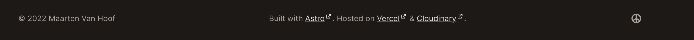
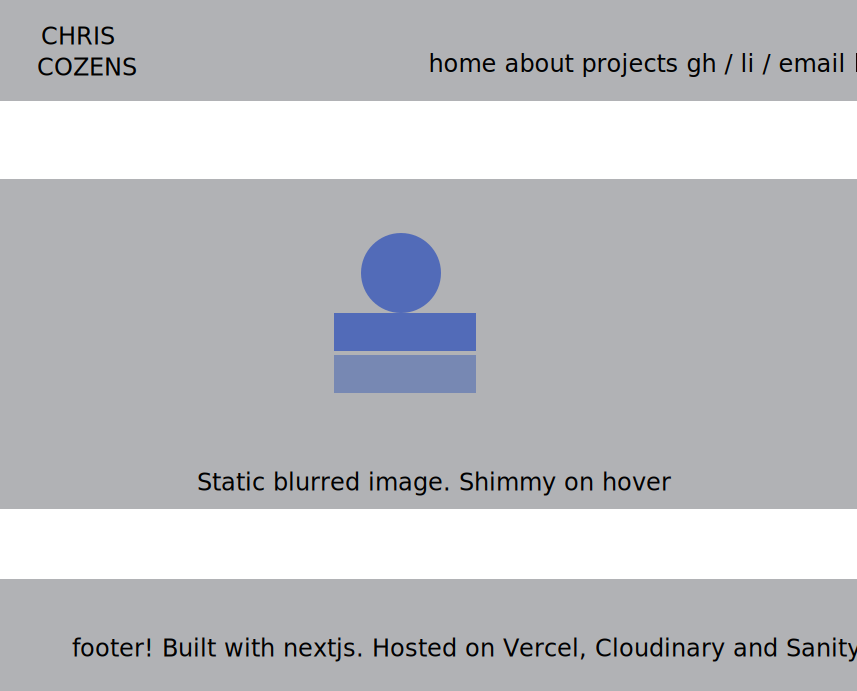

# Ideas


- static gradient background
- dark?
- favicon
- mol bio appears from left ; front eng apepars from right. Offset.
- link transitions? https://css-tricks.com/css-link-hover-effects/

# From syntax highlights 7 Jul 21
https://cudd.io/

- animation for software engineer appearing on load
- simple bottom right nav
- blurred background with name + photo sharp. Photo has gradient border.
- nav - transition on each object so highlight and underline scrolls across on hover
- about page - card + bio, tech stack
- projects as cards (heading should be h3 or h4)

walterjenkins.com

- like tags on blog, though no way to filter by tag

https://suhit.me/

- they loved the [inter font](https://fonts.google.com/specimen/Inter)
- gh/li logos have slight tilt on hover
	=> 
	
	```css
	div:hover {
  		transform: rotate(5deg);
	}
	```
- [gh readme(https://github.com/SuhitAgarwal) simple
- animated hero with pic on front
- email with folded paper plane "Shoot me an email!" and mailto:


jacobpawlak.com

- [resume](https://jacobpawlak.com/wp-content/uploads/2022/01/JacobPawlak_resume.pdf) - pdf loads in browser, really like coloured sections
- sliding transitions between pages
- [tshirt portfolio[(https://jacobpawlak.com/t-shirts/) scroll down and image loads, then text scrolls in


https://mrtnvh.com/

- logo top right = name in caps overlaid, rearranges on hover
- gh/li etc have different coloured background on hover
- page transitions: fast fade out / in
- footer - subtly different colour, like links




# Process
1. next js intro course, then *with jest* starter

	```bash
	npx create-next-app --example with-jest next-profile
	```
	
	Add jest-dom extenders
	
	```bash
	npm install --save-dev @testing-library/jest-dom
	```
	
	
2. syntax.fm highlights episode and browsed for a few ideas
3. Simple penpot sketch 
4. Colours - coolors.co 
	Picked a few I like. [Initial palette](https://coolors.co/ffffe0-80808d-191936-14213d-ccdbdc)  
	
	
```javascript
<!-- Coolors Palette Widget -->
  <script src="https://coolors.co/palette-widget/widget.js"></script>
  <script data-id="08338321356487679">new CoolorsPaletteWidget("08338321356487679", ["ffffe0","80808d","191936","14213d","ccdbdc"],"next-profile-v1"); </script>
```
5. Basic layout: https://codepen.io/ccozens/pen/WNJXqNB

#### Nav styling
 scrolling 
 [playground](https://codepen.io/pen/)
 based on [effect 3](https://codepen.io/kathykato/pen/JjoebyL)
 - at ul level, to remove bullets
 .navList {
    list-style: none;
}

- at li level, to
.navItem {
    display: inline; - display on one line
    padding-left: 1em; - spacing between items
    font-size: 1.6em; - make larger
}

nav mapping:

```typescript
import Link from 'next/link';
import styles from '@/styles/nav.module.css';


const navList = ['Home', 'About', 'Projects', 'Contact'];
    
const navItems = navList.map((item) =>  (
    <li className={styles.navItem}> 
                    <Link href={item.toLowerCase()}>
                        <a className={styles.anchor}>
                        <span className={styles.hiddenAnchor} aria-hidden="true" data-content={item}> </span>
                            {item}</a>
                    </Link>
                </li>
));
const NavMenu = () => {

    return(
        <div>
            { navItems }
        </div>
    )
}

export { NavMenu };
```

one consequence of this was it creates a /home link, as opposed to / , which created a 404 not found error. Happily nextjs provides a [redirect key](https://nextjs.org/docs/api-reference/next.config.js/redirects) for next.config.js :


```javascript
async redirects() {
    return [
      {
        source: '/home',
        destination: '/',
        permanent: true,
      },
    ]
  },
  ```
      
#### nav media query
1. menu
based on [codepen](https://codepen.io/himalayasingh/pen/GzZWyX)
https://blog.logrocket.com/create-responsive-navbar-react-css/
https://medium.com/@codewithmarish/how-to-create-a-responsive-navbar-in-next-js-5198a74fc496
https://www.w3schools.com/css/css_dropdowns.asp
2. actual query


# Sanity
https://vercel.com/integrations/sanity
Clicked "Add sanity"
Logged in with Github and followed prompts
Done!

```bash
// install sanity globally if not already present
npm i -g @sanity-cli

// install sanity for nextjs tooling
npm install next-sanity @portabletext/react @sanity/image-url

// setup sanity
sanity init --coupon syntaxfm2022


```

Options:
Project name: cms-profile-site
Your content will be stored in a dataset that can be public or private, depending on
whether you want to query your content with or without authentication.
The default dataset configuration has a public dataset named "production".
? Use the default dataset configuration? Yes
✔ Creating dataset
? Project output path: /Users/learning/Documents/projects/next-profile/cms-profile-site
? Select project template Blog (schema)
✔ Bootstrapping files from template

followed steps here https://vercel.com/guides/deploying-sanity-studio-with-vercel
note vercel.json goes in nextjs app, not sanity

modify .gitignore to not upload sanity node_modules:

```
cms-profile-site/node_modules
```
(`cms-profile-site` is the name of my sanity project)

git

```bash
git add . && git commit -m "added sanity"

git push
```

Once Sanity Studio is deployed, you will need to add it's URL to Sanity’s CORS origins settings. You can do this from the command line from sanity project dir

```
// localhost for dev

npm --prefix studio run cors:add -- http://localhost:3000 --credentials

// actual URL for deployment
sanity cors add https://your-url.vercel.app --credentials
sanity cors add https://next-profile-v4mi.vercel.app/ --credentials

```

Deploy Sanity studio

```bash
sanity deploy
```
Called it: cms-profile-site.sanity.studio


Create a new file called client.js in the root frontend folder. Open the file and put in the following:

// client.js
import sanityClient from '@sanity/client'

export default sanityClient({
  projectId: 'your-project-id', // you can find this in sanity.json
  dataset: 'production', // or the name you chose in step 1
  useCdn: true // `false` if you want to ensure fresh data
})

The projectId and dataset-name should be the same as those you'll find in your sanity.json file in the studio folder. Now you can import this client when you need to fetch some content from your Sanity project.

Create .env.local in Next project root, as per https://github.com/vercel/next.js/blob/canary/examples/cms-sanity/.env.local.example

Had to install Vercel CLI:

```bash
npm i -g vercel
```

then (in proj root) link to vercel

```bash
npx vercel link
```
**I reminded myself of the purpose here: done is better than perfect. Nextjs comment [you don't need a CMS unless you're hosting 100s of markdown files](https://nextjs.org/blog/markdown). I'm not. So, remove Sanity and host markdown locally**

### Loading svgs into Nextjs
[dev article](https://dev.to/dolearning/importing-svgs-to-next-js-nna)  
[svgr page](https://react-svgr.com/docs/next/)

1. install svgr: ```npm -i --save-dev svgr```
2. amend `next.config.js`

```javascript
webpack(config) {
      config.module.rules.push({
        test: /\.svg$/i,
        issuer: /\.[jt]sx?$/,
        use: ['@svgr/webpack'],
      })
  
      return config
    },
```

3. This broke extant imports, as it now converts all svg imports to React components. To allow this, install `url-loader` and update `next.config.js` again to load SVGs as either React compoents or urls:

```javascript
webpack(config) {
      config.module.rules.push({
        test: /\.svg$/i,
        issuer: /\.[jt]sx?$/,
        use: ['@svgr/webpack', 'url-loader'], // addition here
      })
  
      return config
    },
```

(note webpack say url-loader is deprecated, but there seem to be problems [moving to new Asset Modules with nextjs](https://github.com/vercel/next.js/discussions/36981))

4. import svg into projectLogos.tsx, eg ```import TypescriptLogo from './typescript-tweaked.svg';```
5. store in exported object: ```export const techLogos = { typescript: TypescriptLogo };```
6. import into project.tsx: ```import { techLogos } from "./media/projectLogos";```
7. use:

```typescript
const ProjectPanels = () => {
    
    return (
        <div>
            <techLogos.typescript />
        </div>
    );
};

export default ProjectPanels;

```

# Project images

1. whole screen screen shot (apple+3)
2. upload to cloudinary/projects
3. crop bar from top (h: 1637, gravity_Y: 163):  ```c_crop,h_1637,w_2880,y_163```  
4. scale to fit container 500 px wide and maintain quality 100:  ```c_limit,q_100,w_500```
5. format to webP: ```.webp```
eg
https://res.cloudinary.com/dyvlh6dln/image/upload/c_crop,h_1637,w_2880,y_163/c_limit,q_100,w_500/v1665056519/next-profile/projects/mol-bio-tools.webp
6. For convenience, download and store in public/
